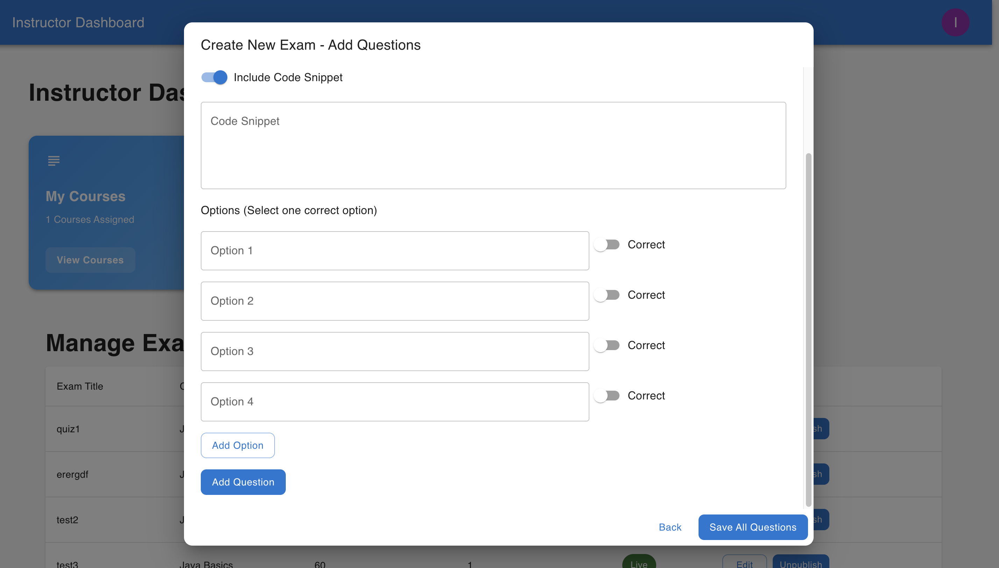

## Table of Contents
* [Project Description](#ExamPilot)
* [Main Features](#main-features)
* [Tech Stack](#tech-stack)
* [ER Diagram](#er-diagram)
* [Screenshots / Demo](#screenshots--demo)
* [Aws Deployment Architecture](#aws-deployment-architecture)
* [Containerization (Docker)](#containerization-docker)
* [Backend Setup](#backend-setup)

  * [Clone](#clone)
  * [Open in IntelliJ](#open-in-intellij)
  * [Install Dependencies](#install-dependencies)
  * [MySQL Config (local)](#mysql-config-local)
  * [Create DB & User (local)](#create-db--user-local)
  * [Run the App](#run-the-app)
  * [Verify API](#verify-api)
* [Frontend Setup](#frontend-setup)
* [Deployment (AWS: S3 + EC2 + RDS MySQL)](#deployment-aws-s3--ec2--rds-mysql)
* [Troubleshooting](#troubleshooting)
* [Notes](#notes)

---


# ExamPilot
ExamPilot is a role-based web app where Admins manage users and courses, Instructors create questions and publish or unpublish exams, and Students enroll and take exams. Students can view their results and overall GPA after submissions. The app provides clear flows for registration, course enrollment, taking exams, and viewing scores.
# Main Features

### 👥 Roles & Access
- **Role-based access control:** Admin / Instructor / Student
- **JWT auth flow:** login + protected APIs (copy-paste `curl` to verify)

### 🎓 Student
- **Register & enroll:** sign up and join available courses
- **Take exams:** timed/untimed attempts with instant submission
- **View GPA & results:** see scores and overall GPA across courses

### 🧑‍🏫 Instructor
- **Course ownership:** teach courses assigned by Admin
- **Question management:** create, edit, and organize questions
- **Exam lifecycle:** **publish** / **unpublish** exams on demand

### 🛠️ Admin
- **User & course administration:** create users, create courses
- **Assignments:** assign courses to instructors


## Tech Stack

### Frontend
- **React (Vite)**
- **Material-UI**
- **Axios** for API calls

### Backend
- **Java (Spring Boot, Maven)**
- **Spring Security (JWT)** for auth
- **Spring Data JPA** for persistence

### Database
- **MySQL** (local & production)
- **H2 → MySQL** migration for prod-ready persistence


### Infrastructure & Deployment
- **Docker** (containerized backend)
- **AWS S3** (SPA hosting)
- **AWS EC2** (Spring Boot container)
- **AWS RDS (MySQL)**

### Dev & Build
- **Maven** (backend build)
- **Node.js + npm** (frontend build)


## Screenshots / Demo





## ER Diagram


## Aws Deployment Architecture


## Backend Setup

### Clone

```bash
git clone <repository-url>
cd exam-platform
```

### Install Dependencies

If you don’t have Maven:

```bash
brew install maven
```

Build:

```bash
mvn clean install
```

### MySQL Config (local)

Update `src/main/resources/application.properties`:

```properties
# Server
server.port=8080

# ===== MySQL (local) =====
spring.datasource.url=jdbc:mysql://localhost:3306/examdb?useSSL=false&allowPublicKeyRetrieval=true&serverTimezone=UTC
spring.datasource.username=exam
spring.datasource.password=exam
spring.datasource.driver-class-name=com.mysql.cj.jdbc.Driver

# JPA / Hibernate
spring.jpa.hibernate.ddl-auto=update
spring.jpa.database-platform=org.hibernate.dialect.MySQL8Dialect
spring.jpa.show-sql=false
```

> Remove old H2 properties if any (`spring.h2.console.*`, H2 URL/driver/dialect).

### Create DB & User (local)

Log into MySQL and run:

```sql
CREATE DATABASE IF NOT EXISTS examdb;
CREATE USER IF NOT EXISTS 'exam'@'localhost' IDENTIFIED BY 'exam';
GRANT ALL PRIVILEGES ON examdb.* TO 'exam'@'localhost';
FLUSH PRIVILEGES;
```

### Run the App

```bash
mvn spring-boot:run
```

Or in IntelliJ: open `ExamPlatformApplication.java` → **Run**.

### Verify API

> Use **your real credentials** here. The `admin/admin` in older examples was only a placeholder for a default user. Replace with an actual user you created (see below).

```bash
curl -X POST http://localhost:8080/api/auth/login \
  -H "Content-Type: application/json" \
  -d '{"username":"<YOUR_USERNAME>","password":"<YOUR_PASSWORD>"}'
```

#### Where do these credentials come from?

* **Option A – Temporary Spring Boot user (for quick local testing only):** add to `application.properties` and login with those creds.

  ```properties
  spring.security.user.name=admin
  spring.security.user.password=admin
  ```

  *Note:* If you implemented custom JWT auth with your own `UserDetailsService`, these properties may be ignored.

* **Option B – Create a user in MySQL:** if you have a `users` table, insert a row (with a **BCrypt** hashed password) or use your existing **register** endpoint to create the first user.

  ```sql
  -- Example only; adjust table/columns to match your schema
  -- password hash for "admin" (example): $2a$10$...
  INSERT INTO users (username, password, role, enabled)
  VALUES ('admin', '$2a$10$<BCryptHashHere>', 'ADMIN', 1);
  ```

---

## Containerization (Docker)

> Backend is containerized. Frontend is still deployed as static assets to S3.

### Build image (backend)

From the backend project root (where your `pom.xml` lives):

```bash
docker build -t exam-backend:latest .
```

### Run locally with Docker (pointing to local MySQL)

```bash
docker run --rm -p 8080:8080 \
  -e SPRING_DATASOURCE_URL="jdbc:mysql://host.docker.internal:3306/examdb?useSSL=false&allowPublicKeyRetrieval=true&serverTimezone=UTC" \
  -e SPRING_DATASOURCE_USERNAME=exam \
  -e SPRING_DATASOURCE_PASSWORD=exam \
  --name exam-backend exam-backend:latest
```

---

## Frontend Setup

Initialize the project:

```bash
npm create vite@latest exam-portal-frontend --template react
cd exam-portal
npm install
```

Install Material-UI and Axios:

```bash
npm install @mui/material @emotion/react @emotion/styled
npm install axios
```

 File Structure:

```
exam-portal-frontend/
├── src/
│   ├── components/   # Reusable UI components
│   ├── pages/        # Views (login, dashboard, exam page, etc.)
│   ├── services/     # Axios API wrappers
│   ├── utils/        # helpers (e.g., token storage)
│   ├── App.js
│   └── main.js
├── package.json
└── README.md
```

For API calls, set your base URL (example with Vite env):

```js
// use import.meta.env.VITE_API_URL in your Axios instance
```

---

## Deployment (AWS: S3 + EC2 + RDS MySQL)

**This project is deployed with:** S3 (frontend) + EC2 (backend) + RDS (MySQL).

### 1) RDS (MySQL)

* Create RDS MySQL instance and note: endpoint, port, DB name, user, password.
* Security Group: allow inbound **3306** from your **EC2** security group.

### 2) EC2 (Backend – Docker)

* Install Docker on EC2 (Amazon Linux example):

  ```bash
  sudo yum update -y
  sudo amazon-linux-extras enable docker
  sudo yum install -y docker
  sudo service docker start
  sudo usermod -aG docker ec2-user
  ```
* Copy/pull your image to EC2 (e.g., `docker load` from tar or `docker pull <registry>/exam-backend:latest`).
* Run the container pointing to **RDS**:

  ```bash
  docker run -d --restart=always --name exam-backend -p 8080:8080 \
    -e SPRING_DATASOURCE_URL="jdbc:mysql://<RDS_ENDPOINT>:3306/<DB_NAME>?useSSL=false&allowPublicKeyRetrieval=true&serverTimezone=UTC" \
    -e SPRING_DATASOURCE_USERNAME=<DB_USER> \
    -e SPRING_DATASOURCE_PASSWORD=<DB_PASSWORD> \
    -e SPRING_JPA_HIBERNATE_DDL_AUTO=update \
    <your-image>:latest
  ```
* EC2 Security Group: allow inbound **8080** (or the port you run).

### 3) S3 (Frontend)

* Build:

```bash
npm run build
```

* Upload the `dist/` contents to your S3 bucket (Static website hosting **ON**).
* Ensure the frontend calls the EC2 backend:

  * Set `VITE_API_URL="http://<EC2_PUBLIC_IP>:8080"` (or your domain)
* If using CORS in backend, allow your exact S3 website **Origin**.
* Build:

```bash
npm run build
```

* Upload the `dist/` contents to your S3 bucket (Static website hosting **ON**).
* Ensure the frontend calls the EC2 backend:

  * Set `VITE_API_URL="http://<EC2_PUBLIC_IP>:8080"` (or your domain)
* If using CORS in backend, allow your exact S3 website **Origin**.

> If the site is up but API calls fail, check:
> (a) EC2 inbound 8080 open, (b) RDS inbound 3306 from EC2,
> (c) frontend base URL points to EC2 (not `localhost`),
> (d) backend CORS allows the S3 website origin.


## Troubleshooting

**Port 8080 in use (local):**

```properties
server.port=8081
```

**MySQL “Public Key Retrieval is not allowed”:**
Keep `allowPublicKeyRetrieval=true` in the JDBC URL.

**Timezone errors:**
Keep `serverTimezone=UTC` in the JDBC URL.

**Auth failures to DB:**
Confirm user host (`'localhost'` vs `'%'`) and password.

**Tables not appearing:**
Ensure `spring.jpa.hibernate.ddl-auto=update`.

---

## Notes

* If you still enable the temporary Spring Boot user (Option A) for quick local checks, remember to **remove it in production** and rely on your real auth (JWT + DB).
* Keep local and AWS security configs aligned (same login route your frontend calls).
